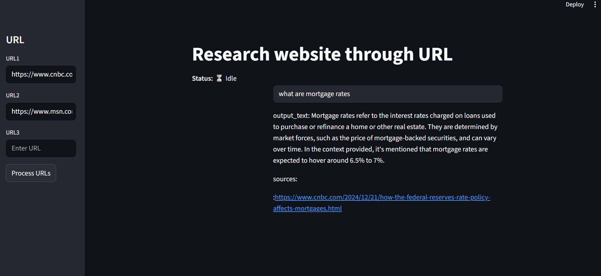

# 🏙️ Research Website Tool

This APP is  streamlined, domain-adaptable research assistant built for extracting insights from  articles. While tailored for real estate, this tool can be extended to any domain with minimal changes.



---

## 🚀 Overview

This project enables users to:
- Load article URLs and extract their content.
- Generate semantic embeddings using HuggingFace models.
- Store and retrieve embeddings via ChromaDB.
- Query the content using LLMs (Llama3 via Groq) and receive contextual answers with source references.

---

## ✨ Features

- 🔗 **URL Loader**: Fetches article content using newspaper’s `Article`.
- 🧠 **Embeddings**: Converts text into vector embeddings using HuggingFace.
- 🗃️ **Vector Store**: Stores embeddings in ChromaDB for efficient retrieval.
- 💬 **LLM Integration**: Uses Groq-hosted Llama3 to answer user queries with source attribution.

---

## ⚙️ Setup Instructions

1. **Install dependencies**
    ```bash
    pip install -r requirements.txt
    ```

2. **Configure environment variables**

    Create a `.env` file in the root directory:
    ```env
    GROQ_MODEL=MODEL_NAME_HERE
    GROQ_API_KEY=GROQ_API_KEY_HERE
    ```

3. **Launch the Streamlit app**
    ```bash
    streamlit run app.py
    ```

---


## 🧪 How to Use

Once the app launches in your browser, follow these steps to explore and interact with real estate news articles:

1. **Input URLs**  
   Use the sidebar to enter one or more article URLs.

2. **Process Articles**  
   Click the **Process URLs** button to begin:
   - The system will validate URLs provided by user and valid URLs are shown on screen.
   - The system will fetch and extract article content.
   - Text will be split into manageable chunks.
   - Embedding vectors will be generated using HuggingFace's embedding model.
   - These vectors are stored in ChromaDB for efficient semantic retrieval.

3. **Ask Questions**  
   After processing, you can ask questions related to the articles. The system will:
   - Retrieve relevant information from the stored embeddings.
   - Provide source attribution for transparency so user know which article is used as reference from provided articles.

### 📰 Sample Articles Used in Tutorial

  - we will use the following news articles
  - https://www.cnbc.com/2024/12/21/how-the-federal-reserves-rate-policy-affects-mortgages.html
  - https://www.cnbc.com/2024/12/20/why-mortgage-rates-jumped-despite-fed-interest-rate-cut.html
  -
